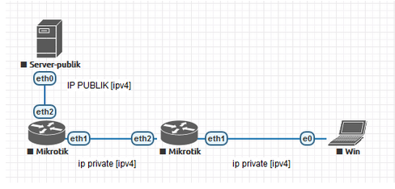

# LAB-7-IP-Public-VS-IP-Private
Rabu 13 Agustus 2025

# Public IP VS Private IP
  **Siswa mampu memahami perbedaan IP Publik dan IP private :**  
  IP Publik adalah IP yang bisa diakses melalui internet dan memungkinkan berbagai macam perangkat berkomunikasi di penjuru dunia.  
  IP Private adalah IP yang hanyak bisa diakses melalui jaringan lokal dan tidak langsung bisa terkoneksi ke internet.  
    
  **Range ip private IPv4 :**  
  10.0.0.0    - 10.255.255.255  
  172.16.0.0  - 172.31.255.255  
  192.168.0.0 - 192.168.255.255  
  
  **Kriteria dari IP Publik :**  
  1. Bisa langsung mengakses internet  
  2. DIberikan oleh ISP  
  3. Tidak termasuk range IP Private  
  4. Bukan IP Reserved  

# IP Reserved  
  IP Address reserved adalah sekumpulan alamat IP yang telah dipesan oleh IANA (Internet Assigned Numbers Authority) untuk fungsi atau tujuan tertentu, dan tidak dapat digunakan sebagai alamat host umum di internet publik.  
  127.0.0.0/8 - Loopback (komunikasi internal perangkat)  
  169.254.0.0/16 - APIPA (alamat otomatis jika DHCP gagal)  
  224.0.0.0 - 239.255.255.255 → Multicast (pengiriman data ke banyak host sekaligus)  
  240.0.0.0 - 255.255.255.254 → Experimental (uji coba protokol)  
  0.0.0.0 - Default address (tidak ada alamat IP tertentu)  
  255.255.255.255 - Broadcast (siaran ke semua host dalam subnet)  

  **Apa 0.0.0.0 dan 0.0.0.0/0 itu berbeda?**  
    0.0.0.0 artinya tidak ada alamat IP tertentu. Sedangkan 0.0.0.0/0 adalah CIDR notation yang artinya semua alamat IPv4 yang ada.  

# Kesimpulan
  IP publik adalah alamat di internet yang bisa diakses dari mana saja, sedangkan IP private adalah alamat yang hanya berlaku di jaringan lokal dan tidak bisa terkoneksi langsung dari internet.
